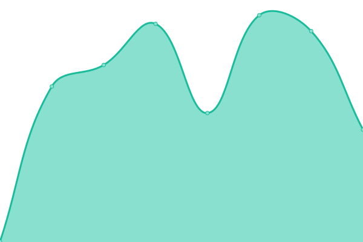

# [📈 Live Status](https://ferdium.github.io/ferdium-status): <!--live status--> **🟩 All systems operational**

This repository contains the open-source uptime monitor and status page for [Ferdium](https://ferdium.org/), powered by [Upptime](https://github.com/upptime/upptime).

With [Upptime](https://upptime.js.org), you can get your own unlimited and free uptime monitor and status page, powered entirely by a GitHub repository. We use [Issues](https://github.com/ferdium/ferdium-status/issues) as incident reports, [Actions](https://github.com/ferdium/ferdium-status/actions) as uptime monitors, and [Pages](https://ferdium.github.io/ferdium-status) for the status page.

<!--start: status pages-->
<!-- This summary is generated by Upptime (https://github.com/upptime/upptime) -->
<!-- Do not edit this manually, your changes will be overwritten -->
<!-- prettier-ignore -->
| URL | Status | History | Response Time | Uptime |
| --- | ------ | ------- | ------------- | ------ |
|  [Website](https://ferdium.org) | 🟩 Up | [website.yml](https://github.com/ferdium/ferdium-status/commits/HEAD/history/website.yml) | 

 507ms
     
 | 

<a href="https://ferdium.github.io/ferdium-status/history/website">100.00%</a>
    

|  [API (Server)](https://api.ferdium.org) | 🟩 Up | [api-server.yml](https://github.com/ferdium/ferdium-status/commits/HEAD/history/api-server.yml) | 

 760ms
     
 | 

<a href="https://ferdium.github.io/ferdium-status/history/api-server">100.00%</a>
    

|  [Debugger](https://debug.ferdium.org) | 🟩 Up | [debugger.yml](https://github.com/ferdium/ferdium-status/commits/HEAD/history/debugger.yml) | 

 742ms
     
 | 

<a href="https://ferdium.github.io/ferdium-status/history/debugger">100.00%</a>
    

|  [Translator](https://translator.ferdium.org) | 🟩 Up | [translator.yml](https://github.com/ferdium/ferdium-status/commits/HEAD/history/translator.yml) | 

 838ms
     
 | 

<a href="https://ferdium.github.io/ferdium-status/history/translator">100.00%</a>
    

<!--end: status pages-->

[**Visit our status website →**](https://ferdium.github.io/ferdium-status)

## 📄 License

- Powered by: [Upptime](https://github.com/upptime/upptime)
- Code: [MIT](./LICENSE) © [Ferdium](https://ferdium.org/)
- Data in the `./history` directory: [Open Database License](https://opendatacommons.org/licenses/odbl/1-0/)
